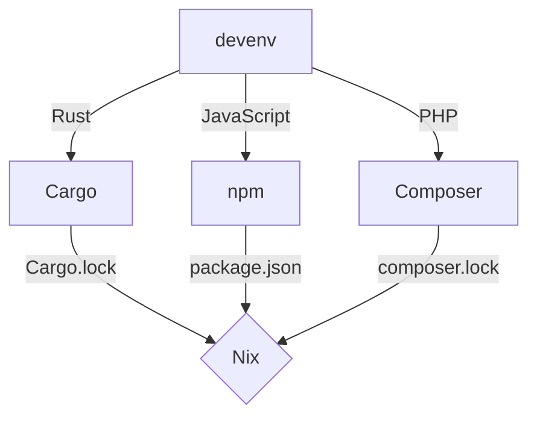
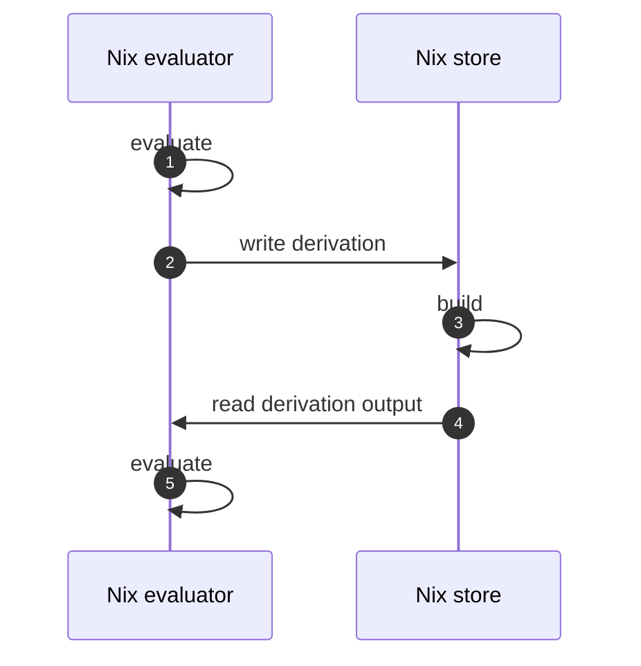

# devenv is switching its Nix implementation to Tvix

In February 2020, I went on a 16-day, 1200km moped trip across northern Thailand with a couple of friends.

<figure markdown="span">
  { width="300" }
  <figcaption>Somewhere in northern Thailand near Pai.</figcaption>
</figure>

As we drove for hours on end, I was listening to an audiobook fittingly called [Crossing the Chasm](https://www.goodreads.com/book/show/61329.Crossing_the_Chasm).
The book explores the challenges faced by nacent technologies on their way to mainstream adoption.

<figure markdown="span">
  
</figure>

In the years that followed, I couldn't help noticing the disconnect between Nix's devoted user base
and its apparent lack of widespread adoption in the broader tech community.

Over 2021 and 2022, I focused my efforts and started [nix.dev](https://nix.dev), a resource for practical and accessible Nix tutorials, thinking that good documentation was the thing holding Nix back.
Eventually, I came to the realization that improving documentation alone will only get us so far.

We needed to fix the foundations.

We needed to remove things to reduce the cognitive load when using Nix.

## The negative feedback loop

Over the years at [Cachix](https://www.cachix.org) we've talked to team after team
abandoning Nix and have observed a surprisingly consistent pattern.

Nix is initially introduced by someone enthusiastic about the technology. Then, faced with
a steep adoption curve, it is abandoned after backlash from the rest of the team.

Making it trivial for a project to adopt and maintain a development environment
is crucial for other team members to see the benefits of Nix.

For example, [Shopify was vocal about Nix way back in 2020](https://shopify.engineering/shipit-presents-how-shopify-uses-nix),
but eventually went quiet. Having companies like Shopify adopt Nix would be a major step forward for the whole ecosystem.

## An interface as the heart of the Developer Experience

Since the [0.1 release two years ago](https://devenv.sh/blog/2022/11/11/hello-world-devenv-01/), we've been rapidly iterating on a declarative interface for
developer environments. We now have support for over [50 languages](/supported-languages/ansible/) and [30 services](/supported-services/adminer/):

```nix title="devenv.nix"
{ pkgs, config, ... }: {
  packages = [
    pkgs.cargo-watch
  ];

  languages.rust = {
    enable = true;
    channel = "nightly";
    rustflags = "-Z threads=8";
    targets = [ "wasm32-unknown-unknown" ];
  };

  processes = {
    backend.exec = "cargo watch -x run";
  };

  services = {
    postgresql.enable = true;
  };
}
```

With the introduction of [tasks in the 1.2 release](https://devenv.sh/blog/2024/09/24/devenv-12-tasks-for-convergent-configuration-with-nix/) and
[Nix caching in 1.3](https://devenv.sh/blog/2024/10/03/devenv-13-instant-developer-environments-with-nix-caching/), we're pretty happy with
the `devenv` command-line interface and the extensible nature of the module system.

The modular architecture of the module system allows for seamless addition, modification, and removal of configuration options.
This flexibility extends to defining [your own options](/composing-using-imports/) for the software you're writing.


## Why do we need a Nix rewrite?

We've been using the **Nix command-line interface under the hood as a low-level API** to
the evaluator and Nix store. We would've preferred to use something akin to an SDK instead, however
the command-line interface was the **most sensible interface two years ago** out of the available options.

The new C FFI (Foreign Function Interface) could potentially grow into a viable solution, but
it would necessitate substantial development effort and still leave us vulnerable to memory-safety
issues. Moreover, the architecture of the Nix codebase is structured more as a monolithic framework rather than a modular library.

Ideally, if we're committing to fixing the developer experience over the next years, we'd want to have Nix implemented as a library in Rust.

Fortunately, such a project already exists and it's called [Tvix](https://tvix.dev). Started by [flokli](http://flokli.de/) and [tazjin](https://github.com/tazjin) in ["Rewriting Nix"](https://tvl.fyi/blog/rewriting-nix),
Tvix is a re-implementation of Nix in Rust, offering both memory-safety and a library-oriented architecture with independently usable components. Leveraging Rust's
abstractions and ecosystem (e.g. [tracing.rs](https://tracing.rs/)), Tvix is positioned to significantly enhance the developer experience for `devenv` developers and users.

There are many architectural differences besides the obvious "Rewrite In Rust" cliche,
so we'll talk about them as we start replacing our Nix command-line calls with Tvix libraries, starting with the evaluator.

## Integrating the Tvix evaluator

The Nix evaluator directly traverses the abstract syntax tree (AST) during evaluation, while Tvix uses a bytecode virtual machine crafted
according to the [Crafting Interpreters](https://craftinginterpreters.com/) book.

Tvix compiles Nix code into compact bytecode, then executes it in a virtual machine. This two-step approach offers potential performance benefits and optimization opportunities,
like many other interpreted languages.

When you re-evaluate `devenv.nix`, you're most likely changing `devenv.nix` and not one of the few dozen Nix files that come from the devenv repository,
or even the few thousand Nix files from the [nixpkgs](https://github.com/NixOS/nixpkgs) repository that could all be cached as bytecode.

In order to integrate the Tvix evaluator with `devenv` we'll need to:

- Finish implementing [builtins.fetchTree](https://cl.tvl.fyi/c/depot/+/12379), where we have some ideas on how to simplify the caching layer
  and get rid of the annoying dependency on GitHub's rate-limited api.github.com endpoint.
- Implement an evaluation debugger that will allow inspecting a program's state in case of errors.
- Finish implementing [tvix-eval-jobs](https://cl.tvl.fyi/c/depot/+/12416) that will be used for regression tests against nixpkgs
  to make sure that the evaluator behaves correctly.
- Create debug tooling for when we discover regressions in the evaluator.
- Integrate a nix-daemon layer to schedule builds.

We also recently streamed a [Let's explore the Tvix evaluator](https://www.youtube.com/watch?v=6FAxZDnsH5w) video for those interested in digging into the code.

## Using language-specific package managers as the build system

Once we've integrated the evaluator, we can finally generalize building languages using Nix reproducible builds
by running the underlying build system to generate Nix expressions:



In [Build Systems à la Carte](https://www.microsoft.com/en-us/research/uploads/prod/2018/03/build-systems.pdf),
Nix is labelled as a suspending task scheduler.

In the general case, the dependency graph is computed statically, but a dependency can
declare its dependencies dynamically as part of the build by returning more Nix code.

That's when evaluation and build phases start to mix, with evaluation depending on the result of a build,
which is typically called import from derivation (as the naming comes from the implementation).



Since evaluation in Nix is single-threaded, the process described above gets blocked on each build requested during evaluation.

Implementing parallel evaluation in Tvix, after we figure out the architectural details of how it should work, will unlock the ability to support automatic conversion
of language-specific build systems into Nix without sacrificing neither the developer experience, nor memory safety.

## Final Words

As we embark on this new chapter with [Tvix](https://tvix.dev), I'm reminded of the journey that brought us here.
It's been a decade since I wrote the [we can do better](https://domenkozar.com/2014/03/11/why-puppet-chef-ansible-arent-good-enough-and-we-can-do-better/) blog post,
highlighting the potential for improvement in configuration management and development environments, and I'm glad to see it all finally coming together.

Keep an eye out for updates and join the discussion:

- Attend ["devenv is switching to Tvix" talk at NixCon](https://talks.nixcon.org/nixcon-2024/talk/AM7K7F/) to learn more about our progress and plans.
- If you'd like to help out by hacking on Rust and Tvix, join us at [OceanSprint](https://oceansprint.org/) for a week of hacking.
- Join the [devenv Discord community](https://discord.gg/naMgvexb6q).
- Join [#tvix-dev on Matrix](https://matrix.to/#/#tvix-dev:hackint.org)
- Subscribe to the mailing list for future announcements at the bottom of the page.

Domen
