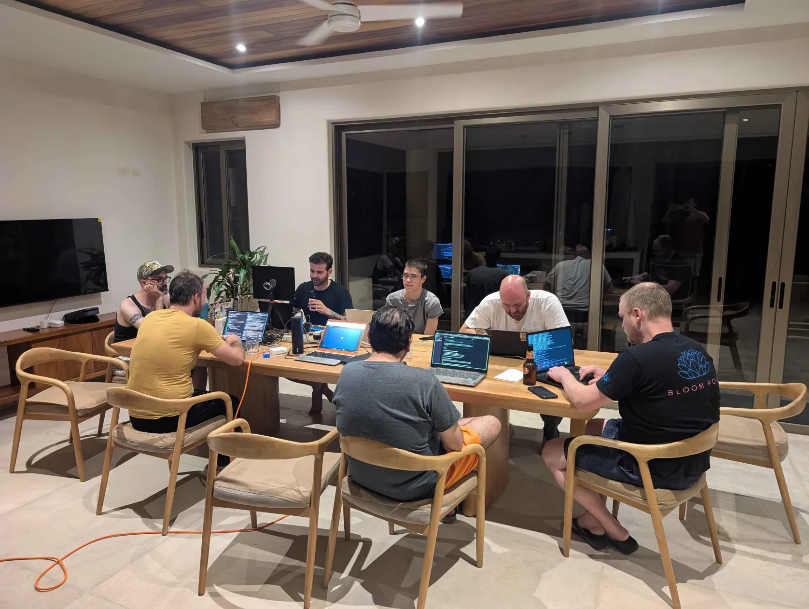

# Making devenv start fast, and the whole nixpkgs with it

I'm sitting here next to [Farid Zakaria](https://github.com/fzakaria) at [Tacosprint](https://tacosprint.org) where we looked at the stat storm that has been haunting nixpkgs for a decade.



[devenv auto activation](../../auto-activation.md) runs `devenv
hook-should-activate` on every shell prompt to decide whether you've stepped
into a project directory. It does almost nothing: discover the project, check
the trust database, print a path. So its runtime is pure startup overhead, and
it runs on every single prompt redraw.

```console
$ time devenv hook-should-activate
/home/domen/dev/myproject
real    0m0.070s
...
```

70ms before a prompt, every prompt.

And this isn't devenv's tax to pay, it's nixpkgs'. Every program pays it before
it runs a line of its own code: the dynamic loader has to find each shared
library, and the way Nix scatters packages across the store makes that search
slow. This is not news. The cost has been measured, written up, and partly fixed
more than once, and yet it has sat in limbo for the better part of a decade with
no general fix merged into nixpkgs.

Most of that is the dynamic loader looking for a shared object that is sitting
right there in the store, just not in the first directory it tried. The loader
knocks on 486 wrong doors before it finds the right ones, and almost all of it
happens before `main` even starts.

That number is the whole game. Above ~30ms you have to bolt a caching layer on
top of the hook; in single digit milliseconds you just run it on every prompt
and throw the cache away.

And it scales with the closure: `imagemagick`'s `magick --version`
makes **1225** failing opens:

```console
$ strace -f -e openat magick --version 2>&1 >/dev/null | grep '\.so' | grep -c ENOENT
1225
```

The community has been circling a real fix for years. This post walks through
the problem, the approaches people have tried with their tradeoffs, and a more
radical one we spiked for devenv to see if it was even possible: deleting the
dynamic loader altogether by linking the whole program into one static binary.

The umbrella tracking issue for the general problem is
[NixOS/nixpkgs#481620](https://github.com/NixOS/nixpkgs/issues/481620).

## Why Nix makes the loader work so hard

On a traditional distribution every shared library lives in a handful of global
directories such as `/usr/lib`. The dynamic loader has a short, mostly cached
search path, and `ld.so.cache` (built by `ldconfig`) turns soname lookups into a
hash table hit.

Nix is different by design. Every package lives in its own
`/nix/store/<hash>-name/lib` directory, and there is no global `ld.so.cache` for
store libraries. To make a binary find its dependencies, Nix records a
`DT_RUNPATH` in the ELF header that lists **one directory per dependency**. A
program linked against fifty libraries gets a `DT_RUNPATH` with dozens of
entries.

Now recall how glibc resolves a `DT_NEEDED` soname with `DT_RUNPATH` present: it
walks every `DT_RUNPATH` directory in order, trying to open `dir/soname` in
each, until one succeeds. So resolving N libraries against a path of M
directories costs on the order of N times M `openat()` attempts, almost all of
which fail. That is the stat storm.

It gets worse. For every directory it searches, glibc first probes the
`glibc-hwcaps` subdirectories for your CPU (`x86-64-v3`, `x86-64-v2`, and so on),
which adds roughly three more failing opens per directory on a modern machine.
On a fast SSD with a warm cache none of this is noticeable. On a slow disk, a
network filesystem, a cold cache, or a low power ARM board, it is the difference
between snappy and sluggish, and it multiplies across every process a shell
script spawns.

Concretely, the two workloads we traced most closely:

| Workload | Loaded libraries | `DT_RUNPATH` dirs | Failing `.so` opens |
|---|---|---|---|
| `devenv version` | 83 | 12 (leaf binary) | ~486 |
| `imagemagick magick --version` | 91 | 35 | ~1225 |

The wider a binary's own `DT_RUNPATH` and the deeper its transitive graph, the
worse the storm.

## What a good fix has to preserve

The reason this problem has stayed open so long is that the obvious fixes break
things people rely on. Any serious solution is judged against a checklist:

- **`LD_LIBRARY_PATH` override.** NixOS injects the GPU driver by putting
  `/run/opengl-driver/lib` on `LD_LIBRARY_PATH`. If a fix stops that from
  winning, graphics break.
- **`LD_PRELOAD`.** Interposers and shims must still load first.
- **The libGL / glvnd runtime swap.** A program built against Mesa must be able
  to pick up the vendor driver at runtime.
- **Two libraries with the same soname.** This is the heart of the Nix model:
  different parts of one closure can legitimately depend on different builds of
  the same soname, and resolution must stay per object.
- **`dlopen`.** Plugins loaded at runtime are a related but separate problem.
- **Cross compilation.** A fix that has to run the target loader cannot cross
  compile cleanly.
- **Disk and closure size.** Whatever metadata you add ships in every NAR.
- **Maintenance burden.** A glibc or loader patch has to be rebased onto
  every new glibc release, and patching glibc rebuilds the world.

No approach so far ticks every box. The interesting part is how each one chooses
which boxes to give up.

## Approach 1: freeze the resolution with absolute paths

The simplest idea: rewrite every `DT_NEEDED` entry from a bare soname like
`libfoo.so.1` to the absolute store path of the library it resolves to. glibc
has a "slash short circuit": a `DT_NEEDED` containing a `/` is opened directly,
skipping all search. No search means no storm, and not even the `glibc-hwcaps`
probes happen.

This is well trodden ground:

- [Farid Zakaria](https://github.com/fzakaria)'s **shrinkwrap** and the
  **nix-harden-needed** tool do exactly
  this as external post processing. Shrinkwrap is described in the paper
  [*Mapping Out the HPC Dependency Chaos*](https://ar5iv.labs.arxiv.org/html/2211.05118)
  (Zakaria, Scogland, Gamblin, Maltzahn, 2022; arXiv:2211.05118), which measures
  the storm directly: an Emacs launch drops from 1823 `stat`/`openat` syscalls
  to 104, a 36 times speedup, and a 900 library MPI application starting across
  2048 processes on NFS goes from 344.6s to 47.8s, 7.2 times faster. Those NFS
  numbers are the clearest evidence that this overhead, invisible on a warm
  local cache, becomes brutal on a network or cold filesystem.
- patchelf [PR #357](https://github.com/NixOS/patchelf/pull/357)
  (`--shrink-wrap`, open since 2021) pulls all transitive `DT_NEEDED` up onto
  the top binary and rewrites them to absolute paths.
- Spack has a similar `bind` feature in the HPC world.
- Inside nixpkgs, this mechanism is already used ad hoc in dozens of packages.

The cost is steep on the checklist. Absolute paths **lose the `LD_LIBRARY_PATH`
override**, so the glvnd driver swap stops working, and you need an exemption
list for libc, the loader itself, the GL stack, and initrd. There is also no
runtime fallback: if the pinned path is gone, the program does not start.

There is also a build time fork in the road here. To rewrite a soname to an
absolute path you first have to resolve it, and there are two ways to do that:
**run the binary's own loader** and record what glibc actually picks, or walk
`DT_RUNPATH` statically and resolve it yourself. The first is exact but executes
target code, so it cannot cross compile; the second cross compiles cleanly. The
absolute path tooling only ever did the first, which is why it stays a manual,
per package tool rather than a default. The static walk is the same technique
the ELF note cache (approach 3) later builds on.

So absolute paths are the zero disk, maximum speed option, attractive for self
contained leaf applications, but wrong as a default because of the override
semantics.

## Approach 2: the RUNPATH symlink farm

If the problem is that the loader searches many directories, give it one. The
farm idea, floated early on by [Linus Heckemann](https://github.com/lheckemann)
(see [#24844](https://github.com/NixOS/nixpkgs/pull/24844)), is: for each ELF,
create
a single directory of symlinks pointing at exactly the libraries that ELF needs,
and set its `DT_RUNPATH` to that one directory.

The crucial detail is that the sonames in `DT_NEEDED` stay short. The farm only
changes where they are found, not how. Because the farm lives in `DT_RUNPATH`,
which the loader consults after `LD_LIBRARY_PATH`, every override keeps working.
And it builds with nothing but stock `patchelf --set-rpath` and symlinks, with
no glibc or patchelf fork, and never executes the target binary, so it cross
compiles.

But keeping the sonames short is also where it breaks the Nix model. A farm
directory is a flat namespace keyed by soname, so it can hold exactly one
`libfoo.so.1`. When a closure legitimately pulls two different builds of the
same soname (the case Nix exists to allow), the farm cannot represent both, and
glibc's soname based dedup collapses them to whichever loads first. Absolute
paths (approach 1) sidestep this because the store path becomes the key; the
farm, which deliberately keeps the bare soname, cannot.

The remaining costs are store pollution and the hwcaps floor. Every ELF gains
its own extra directory of symlinks, so the store fills up with farm directories
that shadow the real libraries. And the farm collapses the per directory
multiplier but **not** the per hwcaps multiplier: the loader still probes
`glibc-hwcaps` inside the one farm directory. So it is a large constant factor
win, not an asymptotic one.

How large depends entirely on how much of the graph you farm:

| Farmed scope | Failing opens | Reduction |
|---|---|---|
| `imagemagick`, binary only (wide 35 dir `DT_RUNPATH`) | 1225 → ~213 | 83% |
| `devenv`, leaf binary only (narrow 12 dir `DT_RUNPATH`) | 486 → 392 | 19% |
| `devenv`, whole graph (every dep built with the hook) | 486 → 88 | 82% |

The two devenv rows are the lesson. Farming the leaf alone barely moves the
needle because the storm there is dominated by the 83 libraries resolving *each
other*, which a leaf only farm never touches. Only whole graph adoption reaches
82%, and the residual 88 are irreducible hwcaps probes rather than real library
searches. So the farm pays off immediately when a package's own binary has a
wide `DT_RUNPATH`, but needs whole graph adoption for closure heavy
applications.

## Approach 3: a per DSO resolution cache in an ELF note

This is the most ambitious approach and, on the checklist, the best. The idea,
designed by [pennae](https://github.com/pennae) in
[#207893](https://github.com/NixOS/nixpkgs/pull/207893): have `patchelf` write a
small `PT_NOTE` into each library that records, for each `DT_NEEDED` soname,
where the loader should find it. A patched glibc reads that note during loading,
between the `LD_LIBRARY_PATH` step and the `DT_RUNPATH` walk, and resolves the
dependency straight from it.

Placing the read after `LD_LIBRARY_PATH` is what makes it safe: overrides,
`LD_PRELOAD`, and the glvnd swap all keep winning, and soname based dedup is
unchanged because the sonames stay short. Each cache entry is either an exact
path, which is opened directly with no search and therefore no hwcaps probing,
or a directory hint for the rare cases that cannot be resolved at build time
(`$ORIGIN` relative entries, or directories that themselves contain a
`glibc-hwcaps` tree).

This is the only approach that preserves every semantic, adds zero closure
references, and eliminates the hwcaps floor as well. pennae's original benchmark
showed an armv7 workload dropping from 44s to 29s (seconds, not ms, measured
under `strace -cf`) with about 24000 fewer syscalls. In our own end to end test of a revived, cleaned up version, a note
bearing binary resolved its dependency with **zero** failing search probes,
versus the full storm for the same binary without the note, while the
`LD_LIBRARY_PATH` override still took precedence.

The price is the heaviest of any approach. It needs **two** source changes: a
glibc patch so the loader understands the note, and a patchelf change to write
it. It is a staging mass rebuild, because patching glibc rebuilds the world.
pennae's draft was closed for lack of a go or no go decision rather than any
technical failure; the main worry raised was the long term maintenance of a
glibc patch.

## Approach 4: a Guix style per package ld.so.cache

Guix solves the same problem in production by shipping a per package
`ld.so.cache`, the same binary format `ldconfig` produces, and having a patched
loader consult it (written up in their
[*Taming the 'stat' storm with a loader cache*](https://guix.gnu.org/en/blog/2021/taming-the-stat-storm-with-a-loader-cache/);
[#207061](https://github.com/NixOS/nixpkgs/issues/207061) proposed it for
nixpkgs). It preserves `LD_LIBRARY_PATH` and is proven at scale,
but building the cache needs `ldconfig`/`ldd` for the target architecture, which
breaks cross compilation, and it hits `buildEnv` collisions and `dlmopen`
namespace issues. The ELF note (approach 3) was in part a response: it reads
`DT_NEEDED` and `DT_RUNPATH` statically and never runs a foreign binary, so it
keeps the same `LD_LIBRARY_PATH` guarantee without those costs.

## Approach 5: delete the loader with static linking

The four approaches above all make the loader's job easier. Static linking
removes the loader instead. For devenv, a self contained CLI, we spiked it:
building the whole closure through `pkgsStatic` (which means musl, since glibc
doesn't support a complete static link) drops `devenv version` and
`hook-should-activate` from about 70ms to about 16ms.

| Build | Loaded libraries | startup |
|---|---|---|
| Baseline (all dynamic, glibc) | 83 | ~70ms |
| Fully static (musl) | 0 | ~16ms |

This is not a nixpkgs fix and was never meant to be. Deleting the loader also
deletes everything the loader does at runtime: loading plugins on demand,
honouring driver and interposer overrides, swapping in the GPU vendor's GL
stack. A lot of nixpkgs depends on that, so static linking can never be a
general default. It works for devenv only because devenv is a self contained CLI
that talks to Nix through its own linked in C API and needs none of it.

One thing surprised us: at 16ms, with the loader gone, devenv is still far above
the ~2ms a static musl hello world starts in, the rest being `execve` mapping
the image and devenv's own startup work. Even so, 16ms is fast enough for the
shell hook to drop its per directory activation cache and just run the check
every prompt.

## What about macOS?

macOS uses a different loader, `dyld`, and the storm isn't there. Nix on Darwin
already ships approach 1: every Mach-O records its dependencies as absolute
store paths in `LC_LOAD_DYLIB` rather than bare sonames, and carries no
`LC_RPATH`. So `dyld` opens each library directly on the first path it tries,
and system frameworks come straight from the in memory dyld shared cache without
touching disk. Where the glibc `devenv` made ~486 failing opens, the macOS one
makes essentially none.

The startup cost macOS does have is specific to Nix. To decide whether to
advertise `x86_64-darwin` as an extra platform, libstore forked a child running
`arch -arch x86_64 /usr/bin/true` on startup, costing ~13ms on every Nix process
on Apple silicon. The fix answers the same question with a `stat` of Rosetta 2's
fixed install path in ~0.01ms
([NixOS/nix#16067](https://github.com/NixOS/nix/pull/16067)).

## Side by side

Every column is framed as a property you *want*, so ✅ is always good and ❌
always a cost. Legend: ✅ yes · ⚠️ with caveats · ❌ no · ➖ not applicable.
Caveats marked ⚠️ or worth a word are footnoted below.

| Approach | No glibc fork | No patchelf change | Cheap on disk | Keeps `LD_LIBRARY_PATH` / glvnd | Keeps dup sonames | Kills hwcaps floor | Cross safe |
|---|:---:|:---:|:---:|:---:|:---:|:---:|:---:|
| Absolute `DT_NEEDED` | ✅ | ✅ <sup>a</sup> | ✅ | ❌ | ⚠️ <sup>b</sup> | ✅ | ⚠️ <sup>c</sup> |
| RUNPATH symlink farm | ✅ | ✅ <sup>d</sup> | ❌ <sup>e</sup> | ✅ | ❌ | ❌ | ✅ |
| Per DSO ELF note | ❌ | ❌ | ✅ | ✅ | ✅ | ✅ | ✅ |
| Per package ld.so.cache | ❌ | ✅ | ✅ | ✅ | ⚠️ <sup>f</sup> | ✅ | ❌ |
| Static linking (musl) | ✅ <sup>g</sup> | ✅ | ❌ <sup>h</sup> | ❌ | ➖ | ✅ | ✅ <sup>i</sup> |

<sup>a</sup> stock `patchelf --replace-needed` ·
<sup>b</sup> breaks on the rare duplicate soname ·
<sup>c</sup> only the static-resolution variant cross compiles, and it is unbuilt ·
<sup>d</sup> stock `patchelf --set-rpath` ·
<sup>e</sup> every ELF gains its own symlink directory in the store ·
<sup>f</sup> `buildEnv` collisions ·
<sup>g</sup> uses musl, not glibc, so no glibc fork to maintain ·
<sup>h</sup> ~82MB binary ·
<sup>i</sup> via `pkgsStatic`

## The final approach

Over the week at [Tacosprint](https://tacosprint.org) we revived the **ELF note cache**, cleaned it up,
and got it built and tested end to end. After a decade in limbo it now works:
the note writer, `patchelf --build-resolution-cache`
([#647](https://github.com/NixOS/patchelf/pull/647)), shipped in
[patchelf 0.19.0](https://github.com/NixOS/patchelf/releases/tag/0.19.0), the
first patchelf release since 0.18.0 in April 2023.

The last thing to land is
[nixpkgs#535735](https://github.com/NixOS/nixpkgs/pull/535735), which turns the note on
across the whole package set. Because it patches glibc it has to go through
`staging`, which rebuilds the world, so every binary in nixpkgs comes out the
other side resolving its libraries straight from the note. That is also where it
gets exercised at scale, and we're committed to fixing whatever shakes out as we
go.

Once it has proven itself there, the longer term goal is to upstream the loader
patch into glibc itself, so the fix isn't a nixpkgs carry but something every
store based, nix style package manager, guix included, can rely on.
